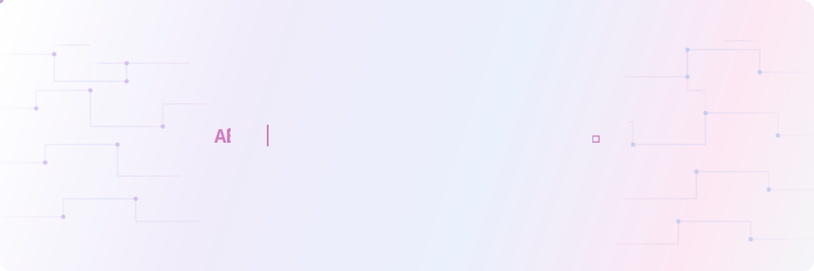

<!-- Animated SVG banner -->

<!-- Social badges -->

---

## 🔥 Streak Stats

---

## 📊 GitHub Profile Stats

---

## 🗺️ Contribution Graph

---

## 🛠️ Tech Stack

### Languages

### Frameworks & Libraries

### Tools & Platforms

---

## 🏆 GitHub Trophies

---

<!-- Footer wave -->

✨ Built with ❤️ using GitHub Readme Stats, Streak Stats & Capsule Render ✨

